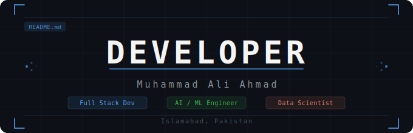

<div align="center">



### Software Engineer · Full Stack Developer · AI/ML Engineer · Data Scientist

[](mailto:aliahmadm754@gmail.com)
[](https://linkedin.com)
[](https://portfolio.com)
[](tel:+923090555415)

</div>

---

## 👨‍💻 About Me

```python
class MuhammadAliAhmad:
    def __init__(self):
        self.name        = "Muhammad Ali Ahmad"
        self.role        = ["Full Stack Developer", "AI Engineer", "Data Scientist"]
        self.education   = {
            "Masters": "Data Science @ FAST University Islamabad (2025–Present)",
            "Bachelors": "Software Engineering @ COMSATS University (2020–2024)"
        }
        self.location    = "Islamabad, Pakistan 🇵🇰"
        self.experience  = "Freelance Full Stack Developer (Jan 2023 – Present)"
        self.hobbies     = ["Coding 💻", "Video Games 🎮"]

    def current_focus(self):
        return [
            "Building AI-powered full stack applications",
            "Pursuing Masters in Data Science at FAST",
            "Exploring RAG systems and local LLMs"
        ]
```

---

## 🛠️ Tech Stack

### 🎨 Frontend


### ⚙️ Backend


### 🤖 AI / ML / Data Science


### 🧰 Tools


---

## 💼 Experience

| Role | Organization | Duration |
|------|-------------|----------|
| 🧑‍💻 Freelance Full Stack Developer | Self-Employed | Jan 2023 – Present |
| 💼 Software Engineering Intern | Techyon Tech | Jul 2024 – Aug 2024 |
| 🏢 Software Engineering Intern | PTV Headquarters, Islamabad | Jan 2024 – Feb 2024 |
| 🏢 Software Engineering Intern | PTV Headquarters, Islamabad | Jul 2023 – Aug 2023 |

---


## 🎓 Education

```
📘  Masters in Data Science          →  FAST University Islamabad      (2025 – Present)
🎓  B.Sc Software Engineering        →  COMSATS University, Wah Campus  (2020 – 2024)
📗  Intermediate (FCS)               →  Sir Syed College, Wah Cantt     (2018 – 2020)
📙  Matriculation (Computer Science) →  Sir Syed College, Wah Cantt     (2016 – 2018)
```

---

<div align="center">

### 💬 Let's Connect & Build Something Amazing!

[](mailto:aliahmadm754@gmail.com)
[](https://linkedin.com)
[](https://portfolio.com)

---

*"Passionate about building software that makes a difference."*


</div>
